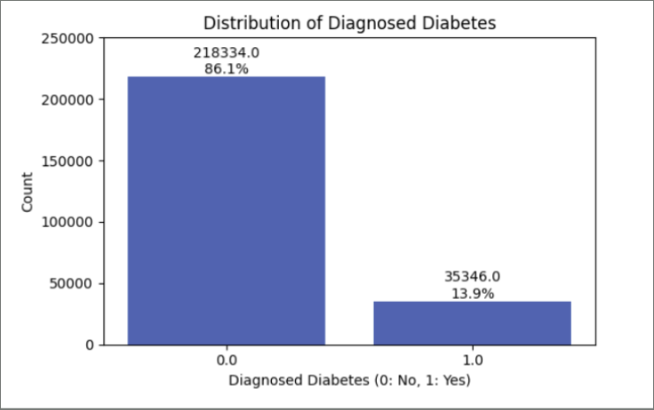
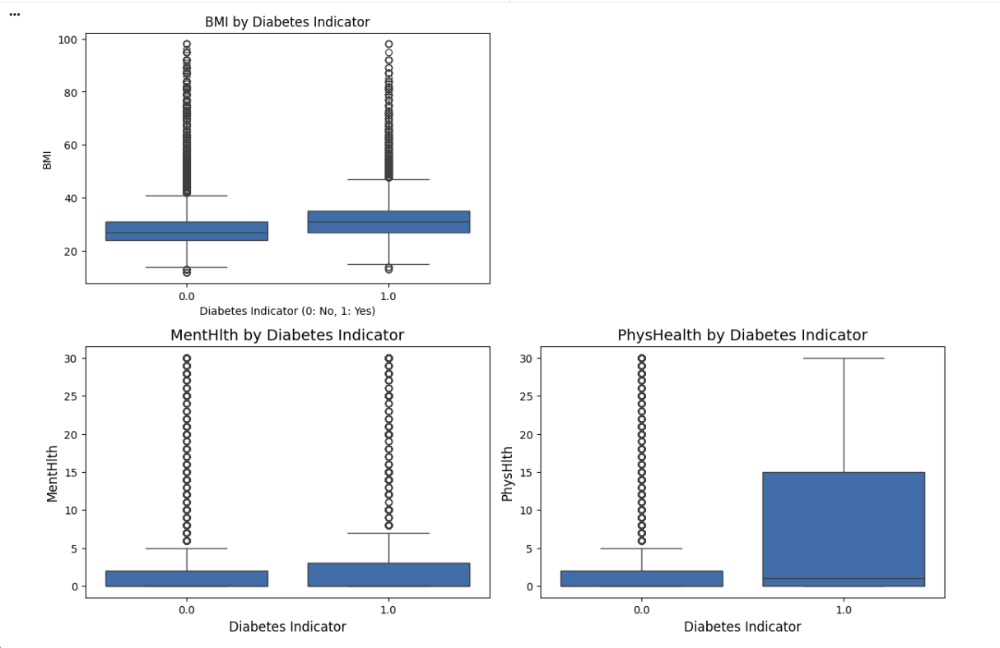
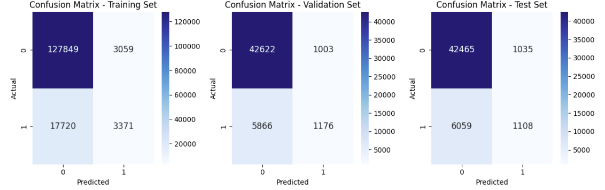

# Diabetes Classification: Predictive Analytics for Employee Health 🏥

## 📌 Project Overview
Type 2 Diabetes Mellitus (DM2) creates a massive economic impact in the U.S., with a total annual economic burden of **$404B** as of 2017.  
This project utilizes the **CDC Health Indicators Dataset** to build a predictive model aimed at the early identification of individuals at risk of undiagnosed diabetes. 

The primary objective is to support employers in targeting prevention resources to reduce long-term medical costs and improve workforce health outcomes.

## 📊 Dataset Description
- **Source:** CDC Diabetes Health Indicators via Kaggle.
- **Size:** 253,680 rows and 22 columns.
- **Target Variable:** `Diabetes_binary` (0 = No, 1 = Yes).
- **Class Distribution:** The dataset is highly imbalanced, with only **13.9%** (35,346 cases) of respondents diagnosed with diabetes.



*Figure 1: Distribution of Diagnosed Diabetes showing significant class imbalance (13.9% positive cases).*

## 🔍 Key Insights from Exploratory Data Analysis (EDA)
- **Clinical Predictors:** Strong associations were found between diabetes and factors such as hypertension, hypercholesterolemia, high BMI, and sedentary lifestyles.
- **Physical vs. Mental Health:** While both are correlated, physical health proved to be a much stronger discriminator for diabetes risk than mental health.
- **Interaction Effects:** Our analysis confirmed that the effect of mobility issues (`DiffWalk`) on diabetes risk is heavily dependent on the patient's age.
- **Unexpected Findings:** Heavy alcohol consumption appeared inversely related to diabetes risk in this specific dataset.


*Figure 2: Analysis of BMI and physical health as primary discriminators for diabetes risk.*

## ⚙️ Model Strategy & Evaluation
- **Data Partition:** 60% Train / 20% Validation / 20% Test.
- **Primary Metric:** **Recall (Class 1)**. In a healthcare context, False Negatives are dangerous; we prioritized maximizing the detection of actual diabetic cases.
- **Handling Imbalance:** Applied **SMOTE (Oversampling)** on the training set to balance the classes (~130,000 samples each), allowing the model to learn minority-class patterns effectively.



*Figure 3: Confusion Matrix for the final Logistic Regression model with SMOTE.*

_Note: SMOTE (Synthetic Minority Over-sampling Technique) generates synthetic data points for the minority class to prevent the model from being biased toward the majority class._

## 🏆 Best Model Performance


*Figure 4: Recall comparison across different models; Oversampling significantly improved detection.*

The **Logistic Regression Model with Oversampling** was selected as the final model for screening purposes.

| Metric | Training Set | Validation Set | Test Set |
| :--- | :--- | :--- | :--- |
| **Precision (Class 1)** | 0.74 | 0.31 | 0.32 |
| **Recall (Class 1)** | 0.78 | 0.76 | **0.77** |
| **F1-Score (Class 1)** | 0.76 | 0.44 | 0.45 |
| **Accuracy** | 0.75 | 0.73 | 0.73 |
| **AUC** | 0.83 | 0.83 | 0.82 |

*Note: While Precision dropped to ~0.32, this trade-off is acceptable for a screening tool where identifying a sick person is more critical than re-testing a healthy one.*

## 💡 Business Recommendations
- **Targeted Screening:** Prioritize employees with High Blood Pressure, High Cholesterol, and High BMI for screening programs.
- **Wellness Investment:** Subsidize nutrition coaching and meal plan support to combat strong lifestyle predictors.
- **Mobility Support:** Provide ergonomic workstations and physical therapy, especially for the older workforce experiencing movement limitations.
- **Financial Support:** Lower copays for screenings and offer free annual checks for lower-income groups to reduce barriers to care.

## 🛠️ How to Run This Project

Follow these steps to reproduce the analysis on your local machine:

### 1. Prerequisites
* **Python 3.8+**
* **Jupyter Notebook** or **JupyterLab**

### 2. Clone the Repository
```bash
git clone [https://github.com/qtracie/diabetes-prediction.git](https://github.com/qtracie/diabetes-prediction.git)
cd diabetes-prediction
```

### 3. Install Required Libraries
```bash
pip install -r requirements.txt

```
### 4. Setup the Data
Place the file diabetes_binary_health_indicators_BRFSS2015.csv inside the data/ folder.

### 5. Launch the Analysis
Open your terminal in the project folder and run:
```bash
jupyter notebook notebooks/diabetes_classification_analysis.ipynb
```

### 6. View the Final Report
For a detailed business and technical summary, refer to the PDF in the reports/ directory:
```bash
reports/Group 2B - Diabetes Classification.pdf
```

